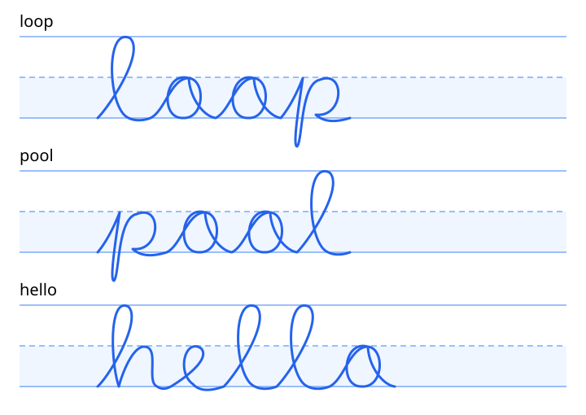

# Guided lesson prototype 1.1

This iteration follows the user's [iPad baseline evaluation](ipad-baseline-evaluation.md). The app displays `Lesson prototype 1.1 · 2026-10-05`; the package display version is 1.1 and bundle version is 2. Use that visible label and the CI artifact's source revision when reporting device results.

## Lessons and guides

The word selector offers **loop**, **pool**, and **hello**. Changing words clears the drawing and previous feedback. The centered writing band has solid top/baseline lines, a dashed middle line, and a highlighted lower half for small-letter bodies. A faint descender line appears for words with p.

Each lesson uses the same hand-authored cubic paths for the thumbnail, optional trace guide, replay, and geometric comparison. Tall l/h reach the top, o/e bodies reach the dashed line, and p descends below the baseline. The example is illustrative, not an expert-validated handwriting model. Replay draws that path over six seconds; it is a visual demonstration, not measured teacher timing or validated stroke-order instruction. Reduce Motion displays the static guide.

The entire lesson scrolls, including controls and results. The canvas itself keeps a fixed zoom/offset so the visible guides and analyzed coordinates agree. Drawing, erasing, and lasso editing are blocked while analysis runs. A canvas resize discards the prior feedback; resizing during evaluation discards its result and asks for another evaluation.

## Feedback meaning

The primary **Practice match** compares actual transformed PencilKit points against the displayed whole-word model. It shows three separately labeled components:

- **Shape (60%)**: symmetric nearest-point distance after uniform fitting and translation. Fitting preserves aspect ratio. Points are resampled by path length within each actual stroke; pen lifts do not create synthetic connecting ink. Small differences below 1.5% of the guide height are tolerated. This checks visible geometry, not stroke direction/order.
- **Position (20%)**: vertical offset from the reference word in the visible writing band, with a small tolerance. Horizontal placement is not graded.
- **Height (20%)**: actual word height relative to the displayed model, using a symmetric logarithmic size difference with a tolerance.

A model copied exactly scores 100 for every lesson. A smaller/moved copy keeps its shape match while height/position feedback changes. A different word, a distorted aspect ratio, and missing ink lower the relevant comparisons. These synthetic cases are regression tests, not evidence that the score is calibrated for children's handwriting. The weights and tolerances are prototype choices.

**OCR read** and character diagnostics are separate. Vision may misread cursive; recognition failure does not suppress the geometry comparison. A high practice match does not prove the spelling/word is correct. Direction, timing, connection quality, and educational mastery are not graded by this practice score. The previous heuristic character scores remain in serialized diagnostics for compatibility but are not displayed as a lesson grade. Feedback no longer claims to compare a teacher template when none is registered.

## Validation and next device evaluation

Foundation-only tests cover all model words scoring 100, compact/large guide layouts, translation, uniform size changes, aspect distortion, wrong-word comparison, sparse/dense input, separate strokes, degenerate input, direction independence, and serialization. The simulator suite also feeds an actual reference `PKDrawing` through the full analyzer and checks its practice match.

CI compilation and tests do not prove UI, Pencil, finger/scroll gesture, tool-picker, or real cursive recognition behavior. On the iPad, confirm the version label; try all three words with and without the trace guide; replay the example; rotate the device; use Clear and change lessons; and record OCR text and shape/position/height scores separately. Test a correctly placed word, a small copy, a word outside the band, and incomplete ink. Use [device-validation.md](device-validation.md) for the full checklist.

Physical acceptance of the baseline is recorded separately. This lesson iteration requires a new device report before its UI and scoring behavior can be called accepted.
